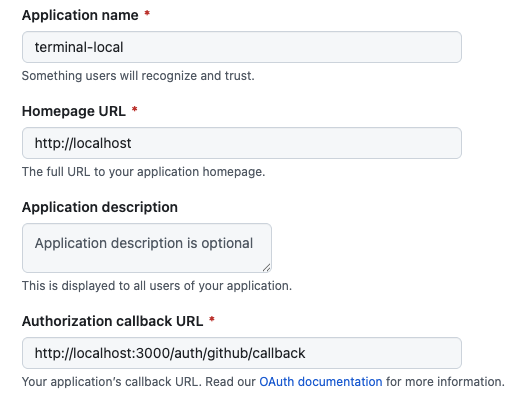

## Purpose

This project is a web terminal that can be embedded in any website. It provides multiple Linux terminal which can be very useful when following online workshops / tutorials.

## Overall Architecture

The following diagram is an overview of the microservices architecture of this application.


In a nutshell:
- a user connects to the terminal using his GitHub account
- in the backend a virtual machine is created on the [Exoscale](https://www.exoscale.com) cloud provider
- this VM leverage the nested virtualization of Exoscale's VM ([read more about nested virtualization](https://www.exoscale.com/syslog/2025-04-01-multipass/))
- a multi-tab terminal is returned to the user. Each terminal has a shell connected via SSH to one of the nested VM

It involves several services:
- web frontend: the one that can be embedded in a website
- a web socket server which proxies the user input to the underlying nested VMs
- an instance manager in charge of creating the VM instances
- a NATS message broker as the communication layer
- a Postgres database that stores the VMs status

## How to use it (for local testing)

- Create a GitHub app to enable GitHub signin.

In GitHub, go to Settings -> developer settings -> OAuth Apps. Create an app with the parameters specified in the screenshot below.



Once the app is created, get the client ID and client secret.

- Set the client ID and client secret in the [github-apps.yaml file](github-apps.yaml)

- Create Exoscale keys with compute role

- Run the backend part using this [Docker Compose specification](./compose.yml)

- Then, import the following script into your website, replacing the placeholders with the details of the GitHub application.

```html
<script src="https://cdn.jsdelivr.net/npm/@w3term/terminal@latest/terminal.min.js"></script>
<script>
const terminal = new WebTerminalEmbed({
    githubAppName: 'your-app-name',
    githubClientId: 'your-client-id',
    backendDomain: 'your-domain.com'
});
</script>
```

## Status

This is still a work in progress (even if this terminal is already functional). 
Documentation and examples will be added soon.